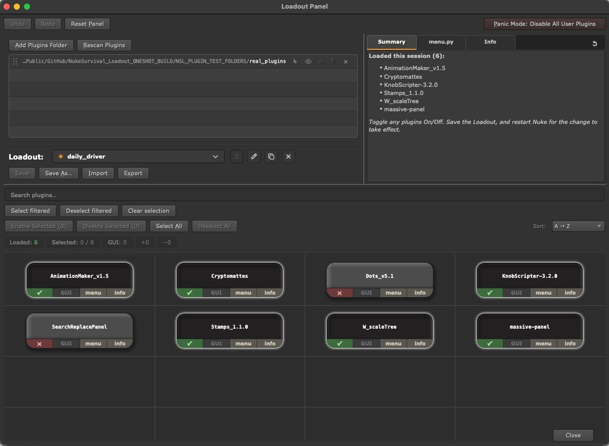

# Nuke Survival Loadout

A Loadout Panel for Foundry Nuke that helps compositors manage and load their plugins.

You need to think about 2 things:

1. WHERE are the plugins?  Drop all your plugins into 1 big folder, and point the panel at this plugins directory.  You can add as many plugin directories as you want.

2. WHAT plugins do you want to load? The panel will try and load each plugin in that folder by default.  But if you want, you can uncheck any plugins that you do not need.  You can also specify which plugins are "GUI-Only" and only need to be loaded during GUI Nuke and not in a terminal Nuke session or the Render Farm.  Save your selection as a "Loadout", which saves a custom file to `~/.nuke/Loadouts/`.  You can save as many Loadout configurations as you want, for quick switches between groups of tools.

Once you have added a plugin directory, save your Loadout, Restart Nuke, and your plugins will load, and the Loadout Panel will reflect what is enabled and disabled in the session.

Each loadout is a small, python init.py file you can open in any text editor. If a bad Plugin ever stops Nuke from starting, you can disable it by hand and recover without the panel just like you would normally in your init.py file if you were loading a plugin from scratch.   

The panel is writing a custom init.py for your plugins and pointing Nuke at it. (Note: This is not overwriting your `~/.nuke/init.py`, it is a separate file in `~/.nuke/Loadouts/<loadout-name>/init.py`, so it is in additional to your own init.py, not a replacement.



**At a glance**

- Save and switch between named Loadouts of enabled Plugins
- Toggle Plugins on and off from a visual panel
- Loadouts are plain Python: editable and recoverable by hand
- Panic mode skips every managed Plugin for emergency recovery
- Works for solo setups and studio / TD shared bases

## Install

1. Unzip and place the `NukeSurvivalLoadout` folder anywhere stable on disk (e.g. inside `~/.nuke/`, or on a studio share).
2. Open (or create) `~/.nuke/init.py` in a text editor and add one line pointing at that folder:

   ```python
   nuke.pluginAddPath("/absolute/path/to/NukeSurvivalLoadout")
   ```

3. Restart Nuke.
4. Open the **Loadout Panel** from Nuke's **Edit** menu (or press **F11**).

That single `pluginAddPath` is the whole install. NSL creates `~/.nuke/loadouts/` automatically the first time you open the panel.

Supported Nuke versions: **Nuke 13 and later**

## Folder layout

```
NukeSurvivalLoadout/
├── init.py          # Nuke boot entrypoint
├── menu.py          # Nuke UI entrypoint
├── nsl/             # implementation package
└── Global/          # optional studio-wide baseline
```

---

Created by Tony Lyons | May 2026
